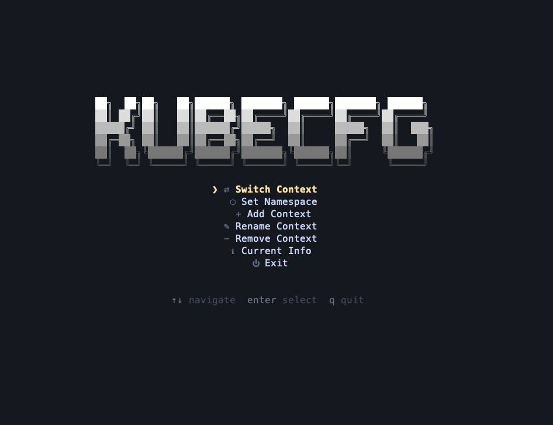

# kubecfg

[](https://github.com/kadirbelkuyu/kubecfg/actions/workflows/ci.yml)
[](https://github.com/kadirbelkuyu/kubecfg)
[](LICENSE)
[](https://github.com/kadirbelkuyu/kubecfg/releases)

kubecfg is a Kubernetes kubeconfig manager for people who switch contexts often and need more than a thin wrapper around `kubectl config`.

It provides fast context and namespace switching, context groups, cluster health checks, and guarded Kubernetes sessions that can route requests through a local policy proxy.



## Key Features

- Interactive TUI for browsing and switching contexts.
- Direct CLI commands for context, namespace, merge, export, validate, and backup restore workflows.
- Optional `fzf` picker integration for context and namespace selection.
- Previous-context toggle with `kubecfg use -`.
- Context groups stored in `~/.kubecfg/groups.yaml`.
- Health checks for all contexts or a single context, with table, JSON, and YAML output.
- Guard sessions with generated kubeconfig files, TTLs, audit logs, and policy profiles.
- Shell completions for Bash, Zsh, Fish, and PowerShell.

## Why kubecfg vs kubectx

`kubectx` is excellent for quick context switching. kubecfg targets a broader kubeconfig workflow:

- Use `kubecfg use -` for kubectx-style previous-context switching.
- Use `kubecfg ns` for namespace switching without writing `kubectl config set-context`.
- Use `kubecfg group` to organize related contexts by environment or team.
- Use `kubecfg status` before switching into stale or unreachable clusters.
- Use `kubecfg guard` and `kubecfg policy` when you want a temporary, auditable access mode around risky clusters.

## Installation

### Go

```bash
go install github.com/kadirbelkuyu/kubecfg@latest
```

For a pinned v0.2.0 install after the release is tagged:

```bash
go install github.com/kadirbelkuyu/kubecfg@v0.2.0
```

### Homebrew

```bash
brew tap kadirbelkuyu/tap
brew install kadirbelkuyu/tap/kubecfg
```

### GitHub Releases

Download the archive for your OS and architecture from:

```text
https://github.com/kadirbelkuyu/kubecfg/releases
```

Release archives include the `kubecfg` binary, `README.md`, `LICENSE`, and SHA-256 checksums.

### From Source

```bash
git clone https://github.com/kadirbelkuyu/kubecfg.git
cd kubecfg
go build -o kubecfg .
./kubecfg --help
```

### Krew

Krew packaging is not configured in this repository for v0.2.0.

## Shell Completion

```bash
# bash
echo 'eval "$(kubecfg completion bash)"' >> ~/.bashrc

# zsh
echo 'source <(kubecfg completion zsh)' >> ~/.zshrc

# fish
kubecfg completion fish | source
```

PowerShell, plugin-manager, and troubleshooting notes are in [docs/shell-completion.md](docs/shell-completion.md).

## Optional fzf Integration

If `fzf` is installed, kubecfg uses it automatically for context and namespace pickers.

```bash
export KUBECFG_IGNORE_FZF=1
```

Set `KUBECFG_IGNORE_FZF` to force the built-in prompt UI.

## Quickstart

These commands assume your kubeconfig is available at `~/.kube/config` or through `KUBECONFIG`.

```bash
kubecfg list
kubecfg current
kubecfg use
kubecfg ns kube-system
kubecfg status
```

Use a specific kubeconfig file with:

```bash
kubecfg --kubeconfig ./config list
```

## Core Commands

### use

Switch context directly, interactively, or back to the previous context.

```bash
kubecfg use
kubecfg use production
kubecfg use -
kubecfg use production --namespace kube-system
kubecfg use production --namespace
```

`--namespace` without a value opens namespace selection after the context is chosen.

### ns

Set or show the namespace for the current context.

```bash
kubecfg ns
kubecfg ns kube-system
kubecfg ns current
```

### status

Check Kubernetes API reachability for one or more contexts.

```bash
kubecfg status
kubecfg status production
kubecfg status --watch
kubecfg status --output json
```

The command exits non-zero when a checked context is unhealthy or unreachable, so it can be used in scripts.

### group

Create named sets of contexts and switch within them.

```bash
kubecfg group create prod --contexts eks-prod,gke-prod --color red
kubecfg group list
kubecfg group show prod
kubecfg group use prod
kubecfg group add prod aks-prod
kubecfg group remove prod old-prod
kubecfg group delete prod --force
```

Group data is stored in `~/.kubecfg/groups.yaml`. See [docs/context-groups.md](docs/context-groups.md).

### policy

Inspect and validate guard policy profiles.

```bash
kubecfg policy list
kubecfg policy show prod
kubecfg policy init
kubecfg policy validate
kubecfg policy create restricted --from prod
```

Built-in profiles are `prod`, `staging`, and `debug`. User-defined profiles live in `~/.kubecfg/config.yaml`.

## Guard and Policy

Guard sessions create a temporary kubeconfig that points the selected cluster at a local kubecfg proxy. The proxy enforces the selected policy profile and records audit events.

```bash
kubecfg guard start --ttl 30m --profile prod
export KUBECONFIG=/path/from/guard/output
kubectl get pods -A
kubecfg guard status
kubecfg guard stop
```

The `prod` profile is readonly and blocks protected resources such as secrets. `staging` allows more traffic but requires confirmation for destructive operations. `debug` is permissive and records allowed requests for troubleshooting.

Audit events can be inspected with:

```bash
kubecfg audit tail
kubecfg audit tail --limit 20
```

## Health Check

`kubecfg status` checks `/readyz` and `/healthz` using the kubeconfig credentials for each context. Results are classified as healthy, degraded, unhealthy, unreachable, or unknown.

```bash
kubecfg status
kubecfg status production --timeout 2s
kubecfg status --output yaml
```

See [docs/health-check.md](docs/health-check.md) for thresholds, cache behavior, TUI refresh behavior, and output details.

## Example Workflows

### Daily context switching

```bash
kubecfg status
kubecfg group use prod
kubecfg ns payments
kubecfg current
```

### Import and validate a kubeconfig

```bash
kubecfg add ./team-prod.yaml --name team-prod
kubecfg validate
kubecfg status team-prod
```

### Prepare a readonly production session

```bash
kubecfg use production
kubecfg policy show prod
kubecfg guard start --ttl 30m --profile prod
kubecfg audit tail
```

### Merge kubeconfigs safely

```bash
kubecfg merge east.yaml west.yaml --output merged.yaml --on-conflict rename
kubecfg --kubeconfig ./merged.yaml validate
kubecfg --kubeconfig ./merged.yaml list
```

## Other Commands

```bash
kubecfg add ./cluster.yaml --name dev
kubecfg list --filter prod
kubecfg current --context production
kubecfg search kube-system
kubecfg export production --output production.yaml
kubecfg merge a.yaml b.yaml --output merged.yaml
kubecfg remove old-dev --force
kubecfg rename old-name new-name
kubecfg undo --list
kubecfg version
```

## TUI Keys

| Key | Action |
| --- | --- |
| `Up` / `Down` / `k` / `j` | Navigate |
| `Enter` | Select |
| `/` | Filter |
| `r` | Refresh guard status in Guard view |
| `[` / `]` | Change guard TTL preset in Guard view |
| `Esc` | Back or cancel |
| `q` | Quit |

## Limitations

- kubecfg manages kubeconfig files; it does not install or configure Kubernetes clusters.
- `fzf` is optional. Without it, kubecfg uses the built-in prompt UI.
- Guard sessions protect traffic that uses the generated guarded kubeconfig. Other kubeconfig files or direct cluster endpoints are outside the guard proxy.
- Krew, APT, Chocolatey, Winget, MacPorts, and AUR packaging are not configured in this repository for v0.2.0.
- Health checks depend on network access and the credentials in the selected kubeconfig.

## Documentation

- [Context Groups](docs/context-groups.md)
- [Health Check](docs/health-check.md)
- [Shell Completion](docs/shell-completion.md)
- [Git Workflow Guide](docs/GIT_WORKFLOW.md)
- [Git Cheat Sheet](docs/GIT_CHEATSHEET.md)

Project docs are published at <https://kadirbelkuyu.github.io/kubecfg/>.

## Development

```bash
go build ./...
go test ./... -race
go vet ./...
golangci-lint run ./...
goreleaser check
```

## License

MIT License
